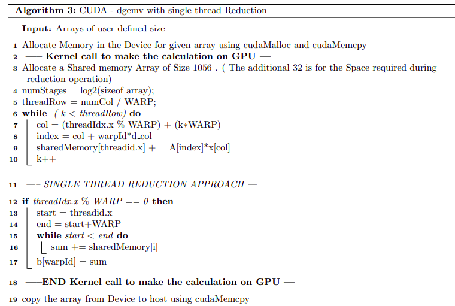
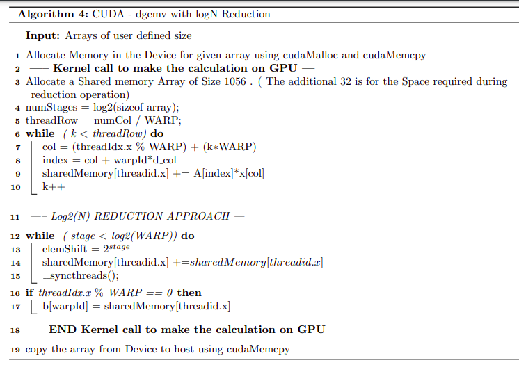

CUDA - Bitonic Sort
===================

Implement the bitonic sort algorithm covered in the class with CUDA
using one thread block. Compare the execution time with the sequential
CPU agorithm on the CPU for the largest data size involving integers
that your implementation can accommodate within the shared memory on the
GPU.

Parallel Methodology
--------------------

The objective is to sort an array by creating an bitonic sequence and
sorting them using only one thread block , this can be achieved by doing
the operations in cyclic manner where the thread block at each cycle
operates with different parts of the array. The Experimentation was
performed with varying number of threads from 400 thousand to 67 million
elements. The compiler nvcc was used with optimisation flag of -O3 for
obtaining the results.

Experimental Setup
------------------

An Array of Random positive integers is taken. The sizes of the arrays
are from 400k to 10 million. The number of threads per block is set as
1024 threads and only one thread block is used for computation of the
problem . The results from the CUDA program are verified

-   To compute the Execution Time of Sequential find Program

-   To compute the Execution time of Parallel program using CUDA
    (without use of Shared Memory )

-   To compare the differences between the timings obtained by using
    shared memory and not using shared memory

All the Timings for the sequential are obtained using the function
clock\_gettime() and for cuda the timing is calculated in host using
function clock\_gettime() before and after kernel calls.
cudaDeviceSynchronize() is used after kernel calls to measure the actual
time taken for kernel execution. Time taken for CUDA including memory
transfer and excluding memory transfer is calculated.

Results
-------

### Iteration Time vs Total Execution time CUDA - without using Shared Memory

### CUDA - Shared memory vs Device Memory

### Sequential vs parallel Speedup

### CUDA - Occupancy diagram

The occupancy achieved using this cuda program is 50%. This might be due
to the fact that sorting process does not use the all the threads at a
time since at each stages in sorting only certain threads will be
activated. The Profiling for cuda is done on Tesla system at CMG which
has a NVIDIA Quadro GV100.

Observation
-----------

-   CUDA without the use of shared memory showed a better performance
    than the CUDA program with shared memory

-   This might be contrary to the fact that shared memory access is more
    faster than Device memory access. However in our problem , the array
    being accessed from the device memory is used only once and swapped
    with another variable. So the process of intermittently storing the
    element in shared memory will only add additional overhead to the
    process.

-   The Sorting algorithm in CUDA seemed to provide an speedup of more
    than 8 times compared to the sequential code, which further proved
    the efficiency of GPU in performing compute intensive tasks compared
    to the CPU.

-   From figure 6, we could observe that the time taken for copying the
    array from host to device and back is very small. Further at higher
    array sizes , it becomes very negligible when compared to the scale
    of the time taken for computation.

CUDA - Merge Sort
=================

The objective was to sort the array using multiple thread blocks so that
each block will sort its own region of array using bitonic sort and
merge them using Parallel Merge sort algorithm.

