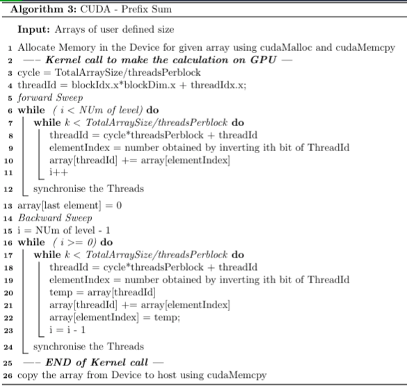
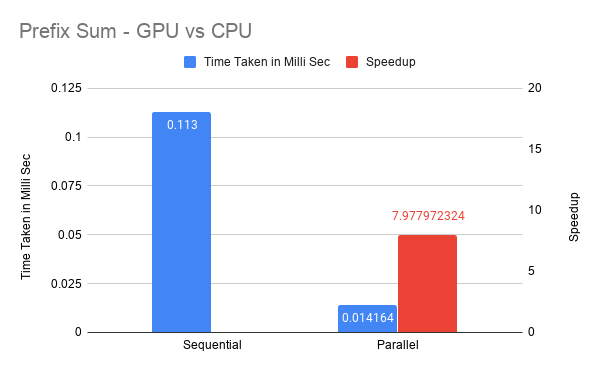

CUDA - Finding Prefix Sum
=========================

Problem Objective
-----------------

Given an array A, the prefix sum problem is to find an output array B
such that B\[i\] = sum(A\[0\],\...,A\[i\]). Objective is to Implement a
prefix program in CUDA that calculates the predix for an input array of
20K integer elements using only one thread block.

Parallel Methodology
--------------------

The way to implement this problem in one block of threads is to assign
the each thread multiple array locations which it has to take care while
performing the computations. The algorithm to compute prefix sum in GPU
is given below

Allocate Memory in the Device for given array using cudaMalloc and
cudaMemcpy\

Results
-------

### Execution Sequential vs Parallel

Observation
-----------

-   The Algorithm shows good scalability for finding the Prefix sum of
    the given array within one thread Block
