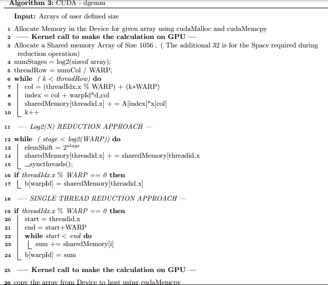
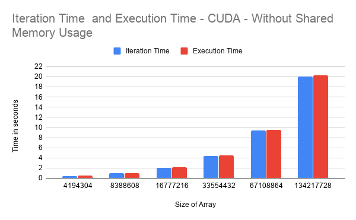
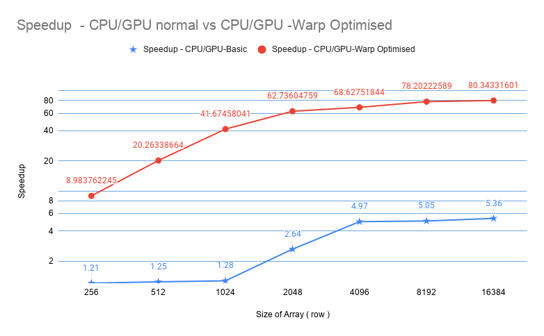

CUDA - Matrix Vector Multiplication 
====================================

To Illustrate the performance benefits of the following optimizations on
GPU with a matrix-vector multiplication program.1,block sizes as a
multiple of warp size (i.e. all warps fully populated) 2, Coalesced
memory access

Parallel Methodology
--------------------

The objective to write a generic dense matrix vector multiplication code
in GPU using CUDA and optimise it by using Warp level Calculations and
also by using Coalesced memory access.\

1.  Each row will be assigned to a Warp of threads ( 32 Threads )

2.  The Total number of threads assigned will be n\_row \* 32 and the
    max num of threads per block will be 1024.

3.  Each warp will calculate the value of a single row and Store it in a
    shared memory array of size 32

4.  Each block will have its own shared memory where it will be saving
    its corresponding row values based on their Local Thread ID

5.  Then the shared memory array of size 32 is reduced either by a
    Single threador by a reduction and saved in device memory

.\

### Single Thread Reduction 

-   After the shared memory array is filled , only the root thread of
    the Warp will perform reduction on 32 Elements

-   This will take 32 Clock Cycles for execution , however no
    sysnchronisation is needed

### Log(N) Reduction 

-   After the shared memory array is filled , The reduction will be done
    in 5 (log2(32)) Steps, by several threads in several stages

-   This will take only 5 thread cycles , however it might need
    additional syncchronisation depending on implementation.

### Warp Level Optimisation 

-   Since the threads are spanned in warp sizes ,there is no need for
    inter warp or inter Block level Synchronisations.

-   The warp level optimisations also ensures the reduction operation
    can be also done without any sync between blocks or warps.

###  Coalesced memory access 

-   The x vector is copied to the Local Shared memory, there by
    providing an contiguous memory access to the x vector.

-   Further , Since the matrix is read in row major order and it is
    accessed by a Warp of Threads, A single fetch from device memory
    might provide a cache locality of other required elements.

Experimental Setup
------------------

An Array of Random positive integers is taken. The sizes of the arrays
range from 256\*256 ( 0.5 MB ) to 16384\*163584 ( 2.17 GB ) are used for
this Analysis

-   To compute the Speedup between sequential program and the Generic
    GPU code without any optimisation

-   To compute the speedup between the normal GPU code without any
    optimisation and GPU code with Warp level Optimisation

-   To compare the speedup difference between the Single thread
    reduction approach and the log(N) reduction approach.

All the Timings for the sequential are obtained using the function
clock\_gettime() and for cuda the timing is calculated in host using
function clock\_gettime() before and after kernel calls.
cudaDeviceSynchronize() is used after kernel calls to measure the actual
time taken for kernel execution. Time taken for CUDA computations is
calculated exckuding the time taken for copying host to device and
device to back\
All Calculations are verified for correctness of result using an
Sequential code.\
Further, The GPU profiling is done on the NVIDIA V100

Results
-------

### Iteration Time vs Total Execution time CUDA - without using Shared Memory

### Speedup  - CPU/GPU normal vs CPU/GPU -Warp Optimised

### Speedup  - GPU normal/ Warp Optimised Single Thread Reduction vs GPU normal/GPU -Warp Optimised Log(N) reduction

Observation
-----------

-   From the figure
 , it is observed that the GPU with warp
    level optimisation performs well as the matrix size increases

-   The Speed Up obtained for Optimised GPU code with respect to the
    Optimised GPU code is **20 times** greater.

-   From figure[\[fig:my\_label3\]] The single thread Reduction was very
    efficient compared to the logN reduciton used with synchronisation.

-   However, the difference in speedup between the two reduction
    techniques reduces as the matrix size increases

-   The reason for the optimised cuda code to provide this level of
    speedup is well explained by the occupancy diagram

-   The optimised cuda code has near to 100% occupancy compared to the
    50% for non optimal code

-   From the timeline figure
   , we could obseve that the most of time
    was taken for data transfer from host to device and back ,Which
    emphasises the importance of asynchronous communication in order to
    reduce time.
